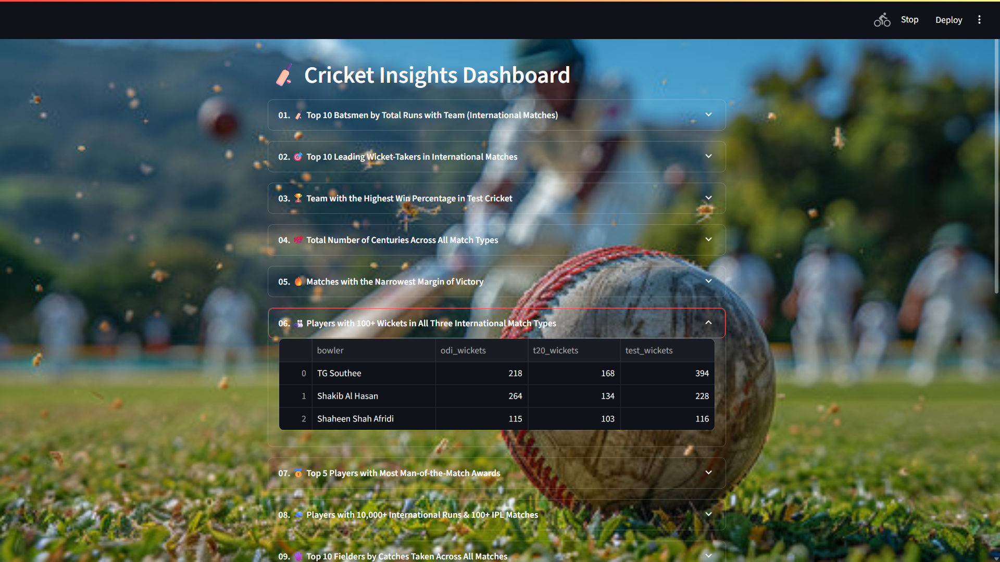
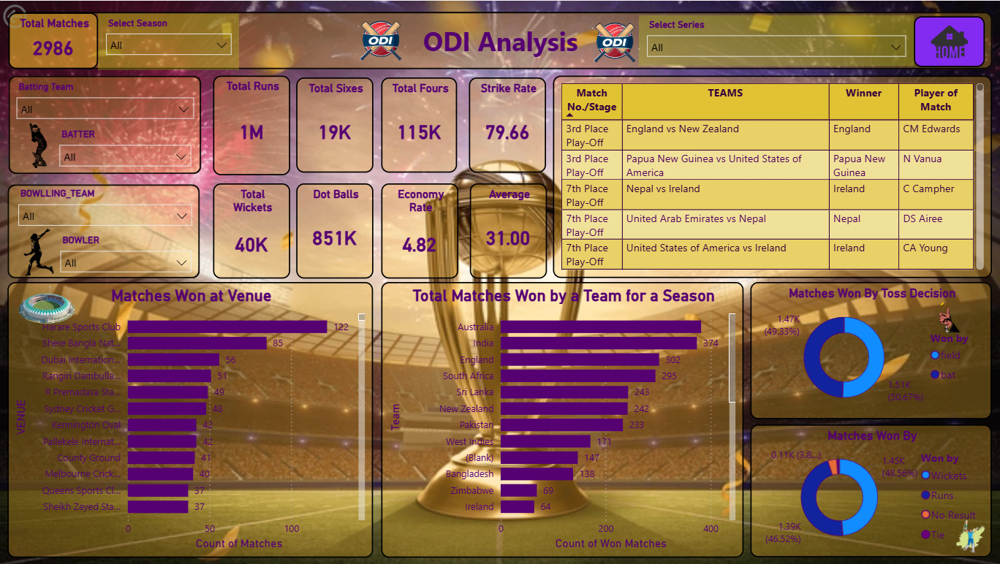
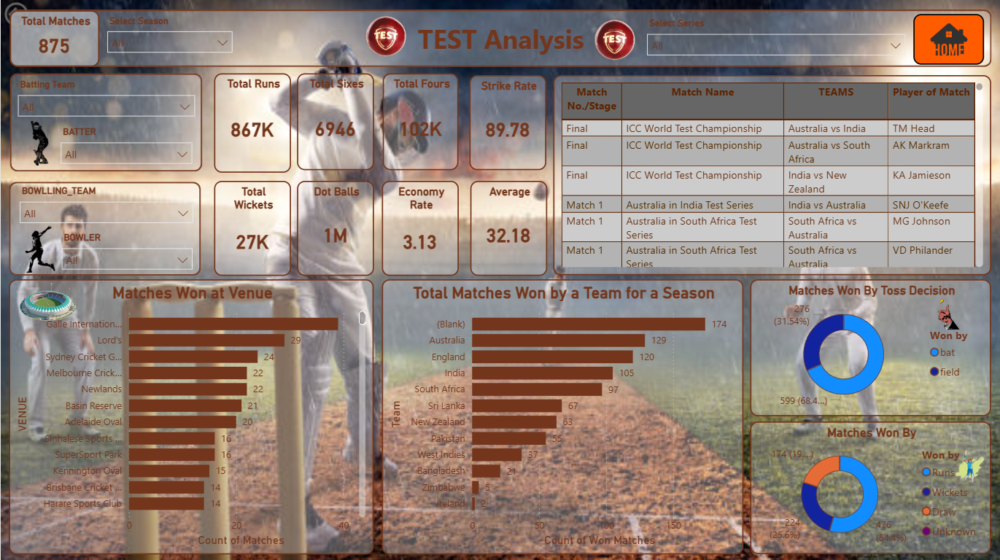

# 🏏 Cricsheet_Data_Analysis

## 📌 Problem Statement

The goal of this project is to **extract, transform, analyze, and visualize cricket match data** from **Cricsheet** across different formats — **Test, ODI, T20, and IPL**.  
The raw data is available in **JSON format**, which is nested and not suitable for direct analysis.  
This project builds a **data pipeline** that converts JSON files into **SQL tables**, performs **performance analysis using SQL queries**, and visualizes insights through **Power BI** and a **Streamlit web application**.

---

## 🎯 Project Objectives

- 📥 Download and parse cricket match data in JSON format from Cricsheet  
- 🔄 Transform raw JSON files into structured **Pandas DataFrames**  
- 🗄️ Store processed data in a **MySQL relational database** using SQLAlchemy & PyMySQL  
- 🧱 Design separate tables for each match format (**Test, ODI, T20, IPL**)  
- 📊 Write and execute **20+ SQL queries** to derive player & team insights  
- 📈 Build an **interactive Power BI dashboard** for match analytics  
- 🌐 Develop a **Streamlit web application** to dynamically display SQL insights  

---

## 🛠️ Technologies Used

- 🏏 **Data Source**         : Cricsheet (JSON Format)  
- 🐍 **Programming Language**: Python  
- 🔄 **Data Processing**     : Pandas, JSON  
- 🗄️ **Database**            : MySQL, PyMySQL, SQLAlchemy  
- 📊 **Data Visualization**  : Power BI  
- 🌐 **Web Application**     : Streamlit  
- 💻 **Development Tools**   : VS Code, Jupyter Notebook  

---

## 🌐 Streamlit Dashboard Screenshots

📌 **Interactive SQL-based insights dashboard**

---

## 📊 Power BI Dashboard

🔗 **Live Dashboard Link:**  
👉 [Click here to view the Power BI Dashboard](https://app.powerbi.com/view?r=eyJrIjoiOGZmYzdjMjYtYWIyNi00M2MxLWE4OTgtODA1ODNjNzRiNzllIiwidCI6ImNiNmMxMjcwLWVjNmItNDI1Mi1iNzcwLWFkMDQ1NDQxOTgzZCJ9)

### 📸 Power BI Dashboard Screenshots

| 🏠 HOME | 🏏 IPL | 🌍 ODI |
|------|------|------|
|  |  |  |

| ⚡ T20 | 🧪 TEST |
|------|------|
|  |  |

---
